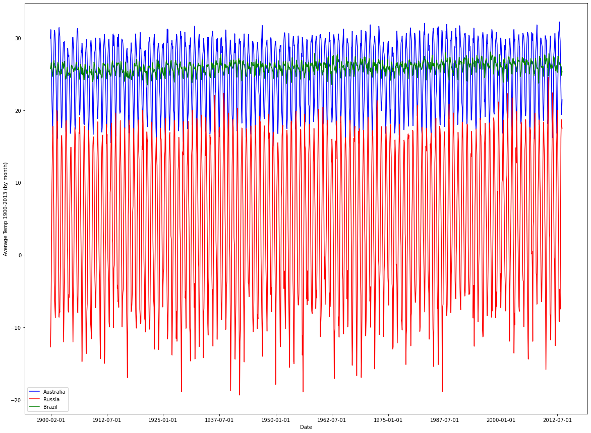

# This is a large header

These are some words too.

Look I can make lists!
  1. one thing
  2. second thing
  3. the last thing


```python
%matplotlib inline
import pandas as pd
import matplotlib.pyplot as plt
import ipywidgets as widgets
from ipywidgets import interact
import numpy as np
```


```python
threeStates = pd.read_csv('Braz-Aus-Rus.csv')
brazil = threeStates.loc[threeStates['Country'] == 'Brazil'].values
data = {'dt': brazil[:,0], 'AverageTemperature': brazil[:,1], 'AverageTemperatureUncertainty': brazil[:,2], 'State': brazil[:,3], 'Country': brazil[:,4]}
brazilTable = pd.DataFrame(data=data)
aus = threeStates.loc[threeStates['Country'] == 'Australia'].values
data = {'dt': aus[:,0], 'AverageTemperature': aus[:,1], 'AverageTemperatureUncertainty': aus[:,2], 'State': aus[:,3], 'Country': aus[:,4]}
ausTable = pd.DataFrame(data=data)
rus = threeStates.loc[threeStates['Country'] == 'Russia'].values
data = {'dt': rus[:,0], 'AverageTemperature': rus[:,1], 'AverageTemperatureUncertainty': rus[:,2], 'State': rus[:,3], 'Country': rus[:,4]}
rusTable = pd.DataFrame(data=data)
```


```python
plt.rcParams['figure.figsize'] = [20, 15]

date = rus[:,0]
b = brazil[:,1]
a = aus[:,1]
r = rus[:,1]

fSB = widgets.FloatSlider(
    value=1.0,
    min=0.0,
    max=1.0,
    step=0.1,
    description='Acre, Brazil:',
    disabled=False,
    continuous_update=False,
    orientation='horizontal',
    readout=True,
    readout_format='.1f',
)

fSA = widgets.FloatSlider(
    value=1.0,
    min=0.0,
    max=1.0,
    step=0.1,
    description='Northern Territory, Australia:',
    disabled=False,
    continuous_update=False,
    orientation='horizontal',
    readout=True,
    readout_format='.1f',
)

fSR = widgets.FloatSlider(
    value=1.0,
    min=0.0,
    max=1.0,
    step=0.1,
    description='Moscow City, Russia:',
    disabled=False,
    continuous_update=False,
    orientation='horizontal',
    readout=True,
    readout_format='.1f',
)

def plot_plot():
    plt.plot(date, a, color='b', label='Australia', alpha=fSA.value)
    plt.plot(date, r, color='r', label='Russia', alpha=fSR.value)
    plt.plot(date, b, color='g', label='Brazil', alpha=fSB.value)
    
    newDate = date.flatten()
    plt.xticks([1,150,300,450,600,750,900,1050,1200,1350])

    plt.xlabel('Date')
    plt.ylabel('Average Temp 1900-2013 (by month)')

    plt.legend()
    plt.show()
    
plot_plot()

plt.figure(figsize=(6, 2))
display(fSA)

plt.figure(figsize=(6, 2))
display(fSR)

plt.figure(figsize=(6, 2))
display(fSB)
```





    FloatSlider(value=1.0, continuous_update=False, description='Northern Territory, Australia:', max=1.0, readout…


    FloatSlider(value=1.0, continuous_update=False, description='Moscow City, Russia:', max=1.0, readout_format='.…


    FloatSlider(value=1.0, continuous_update=False, description='Acre, Brazil:', max=1.0, readout_format='.1f')


    <Figure size 432x144 with 0 Axes>


    <Figure size 432x144 with 0 Axes>


    <Figure size 432x144 with 0 Axes>


```python
'''

The dashboard was created to show the differences in average temperature of 3 areas from 1900-2013. The areas are 
(Acre, Brazil, Northern Territory, Aus., and Moscow City, Russia). This is mostly plotted by pulling the data out of a .csv 
file that holds the data, put into different tables to hold that data, and then the tables are plotted together. The sliders
are to help focus on specific graphs, to make them a little easier to see by themselves instead of just comparing all 
together. The sliders are made with a python library used for interactivity. 

This data was pulled from https://www.kaggle.com/berkeleyearth/climate-change-earth-surface-temperature-data
It is usable via the CC BY-NC-SA 4.0, which means for non commercial use, with attribute.
It's meant for people to look at climate and weather change on their own, to make their decisions about it
Since the datasets from the site are big and not squeaky clean to use, I took out 3 states from the 
GlobalLandTemperaturesByState.csv (Acre, Brazil, Northern Territory, Aus., and Moscow City, Russia) to show differences in
different parts of the world. The fields include dt (date, from 1900-2013), AverageTemperature, 
AverageTemperatureUncertainty (the 95% confidence interval around the average, basically an anomoly range), State, and 
Country. It's got 4,093 rows and 5 columns. 

Sizes:
Mine: Braz-Aus-Rus.csv - 178 KB 
Original: GlobalLandTemperaturesByState.csv - 29.3 MB

'''
```
